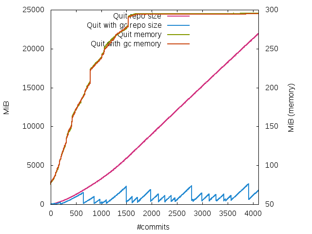

# Results

This was a run on a laptop with:
* CPU: Intel Core i7-5600U, 2.6GHz, two physical cores (4 virtual cores)
* SSD: SAMSUNG MZ7LN512HCHP-000L1, 476.94GiB
* RAM 15.4GiB, 1600MHz
* OS: Debian GNU/Linux 8 (jessie) 64-Bit

I've ran the bsbm with 40 warmup runs and 1500 querymix runs

# Reproduce

The quit store should be on commit 7aae256b2f8f41ae7ac4da363a8511aee43d9f24

## BSBM named graph handling

To correctly write the data to the named graph, we have added the graph pattern to `queries/update/query1.txt` and `queries/update/query2.txt`:

    INSERT DATA {
    GRAPH <urn:bsbm> { %updateData% }
    }

    DELETE WHERE
    { GRAPH <urn:bsbm> { %Offer% ?p ?o } }

TODO: we should check if this is realy needed, or if we can correctly evaluate the URL parameter sent by the testdriver

## Setup data and monitor execution

We expect this repository to be directly checked out into a directory named `quit-eval`, which resides next to the `bsbmtools-0.2` directory.

Create BSBM datasets

    # Run inside the bsbmtools-0.2 directory
    ./generate -pc 1000 -ud -tc 1000 -ppt 1

Due to the configured python maximum recursion depth of `1000`, which is exceeded in the RDFlib query parser, we have to post process the generated update dataset and truncated each of the products to 289 statements. (This clearly breaks rule 4 in section 2 of the benchmark rules provided with the BSBM 14 but appropriate for the proof of concept in our eyes and since the data generator doesn't provide the necessary options.)

    ./trim.py ../bsbmtools-0.2/dataset_update.nt dataset_update_trimmed.nt
    mv dataset_update_trimmed.nt ../bsbmtools-0.2/dataset_update.nt

This should not be needed if the recursion depth is increases accordingly, e.g.

    sys.setrecursionlimit(2 ** 15)

Start the testruns

    ./run-everything.sh

# Verification of a quit repository after the bsbm execution

reset the repository to the initial commit

    git reset --hard init-graph

    sed "s/.$/<urn:bsbm> ./g" ../bsbmtools-0.2/dataset.nt | sort -u > graph.nq
    ./verify.py <quit_repo>-log/run….log <quit_repo> graph.nq

# Verification of the Merge strategy

## Configure Quit Merge Strategy:

Add these lines to your `~/.gitconfig`

    [merge "quitmerge"]
    name = Quit – Quads in Git – merge driver
    driver = quit-merge %O %A %B

and these lines to a `.gitattributes` file in a git repository:

    *.nt    merge=quitmerge
    *.nq    merge=quitmerge

1. create an empty git repository
2. add a `.gitattributes` file which points to the configured *QuitMerge* strategy.
3. get the `dataset.nq` file from above
4. run `./merge.py`

    ./merge.py <the git repo> <path to graph.nq> [--seed <any seed>] [--result <the correct merge result>]

(If you want to verify the merge result your self, you can use the `--result` option to dump the expected result)

# Formate results for gnuplot

The script `./evaluate.py` helps in this case.

For generating the output regarding QMpH and QpS run

    ./evaluate.py --bsbm

For aligning the memory log of the run with the number of commits at this point in time run:

    ./evaluate.py --align <name of the run> > <name of the run>.dat

Where `<name of the run>` is the directory name of the respective run without the `-log` suffix. E.g. `quit-gc-2`.

If you don't have GitPython installed you can use `pip install -r requirements.txt`.
